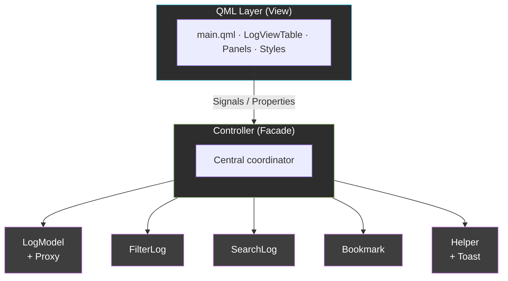
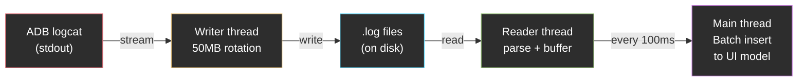

# Catchy — Slide Presentation

---

## Page 1: Title

**Catchy — Desktop Log Viewer**

- A modern log analysis tool for embedded/Android developers
- Tech stack: Python + PySide6 (Qt/QML)
- Standalone `.exe` — no installation required

---

## Page 2: Problem Statement

**Pain points when debugging embedded/Android systems:**

| Problem | Impact |
|---------|--------|
| Log files are huge (100MB–500MB+) | Hard to navigate, editors freeze |
| Finding relevant logs is tedious | Manual `grep` / Ctrl+F in text editors |
| Filtering by process/tag requires CLI | Steep learning curve, slow workflow |
| Switching between live stream and file analysis | Multiple tools needed |
| Losing track of important lines | No way to mark/jump back |
| No quick way to share log snippets | Copy-paste from terminal is messy |

---

## Page 3: Solution — Key Features

1. **Log file loading** — Open and parse large files with progress indicator
2. **Live logcat streaming** — Real-time ADB logcat with auto-scroll
3. **Process filters** — Named color-coded filters, persisted to JSON
4. **Multi-keyword search** — Highlight multiple terms with different colors (10-color palette)
5. **Bookmarks** — Save/jump to important log lines
6. **Scrcpy integration** — Mirror Android screen alongside log viewing
7. **Column visibility** — Show/hide columns for focused reading
8. **Theme support** — Dark and Light modes
9. **Standalone executable** — Distributable without Python installation

---

## Page 4: Architecture Overview



- **Pattern:** MVVM — Python = ViewModel/Service, QML = View
- **Backend:** Controller orchestrates all services; Worker threads handle I/O
- **Frontend:** Declarative QML UI with data binding to Python properties

---

## Page 5: Large File Loading — How It Works

```
User opens file → Worker thread starts
    → Binary read (64KB chunks)
    → Format pre-detection (picks 1 parser for entire file)
    → Parse all lines with chosen fast parser
    → Progress emitted every 5,000 lines
    → Single model update when complete
```

**Key optimizations:**

| Technique | Benefit |
|-----------|---------|
| 64KB binary buffer | Faster than Python's `readline()` |
| Format pre-detection | 1 parser/line instead of trying 3 |
| Tag string interning | ~60% heap reduction for duplicates |
| Single data store | No duplicate `_logDict` — 1× memory |
| Worker thread | UI stays responsive during load |

---

## Page 6: Live Logcat Streaming — How It Works



- **Rate limiting:** Flush timer at 100ms → UI updates max 10×/sec
- **File rotation:** Split at 50MB to prevent unbounded growth
- **Auto-scroll pause:** Stops UI flushing for smooth manual scrolling

---

## Page 7: Threading Model

| Thread | Purpose |
|--------|---------|
| Main (UI) | QML rendering, property updates |
| `_loadLogFileThread` | File loading & saving |
| `_logcatThread` | ADB → file writer (50MB rotation) |
| `_logcatStreamThread` | File → buffer reader |
| `_filterThread` | Filter add/update operations |
| `_searchThread` | Search execution |

All workers use `Worker(QObject)` with `taskCompleted` signal — clean thread lifecycle management.

---

## Page 8: Filter & Color System

- **Lazy computation:** Colors are NOT stored per-row — computed on-demand in `data()` role
- **Filter colors:** Regex match against process name → assigned color
- **Level colors:** Direct dict lookup (V/D/I/W/E/F)
- **Proxy model:** Custom Python proxy with precomputed index list
  - `_rebuild()`: O(N) single pass + `beginResetModel/endResetModel`
  - Streaming support: new rows checked and appended incrementally

---

## Page 9: Performance Results

| Metric | Implementation |
|--------|---------------|
| File loading | Worker thread + 64KB binary chunks — UI responsive |
| Memory | Single store + tag interning — no duplicates |
| Parsing | Format pre-detection — 1 parser per line |
| Filter change | Lazy color in `data()` — no full recolor |
| Save | Chunked 10K rows with progress — bounded memory |
| Streaming | 100ms batch flush — decoupled from parse rate |

**Target:** Handle 100MB–500MB+ files smoothly

---

## Page 10: Benefits

- **Productivity** — No more manual `grep` or Ctrl+F in text editors
- **Visual clarity** — Color-coded processes and search terms make patterns easy to spot
- **All-in-one** — File viewer + live stream + device mirror in one tool
- **Cross-workflow** — Post-mortem analysis and real-time debugging
- **Lightweight** — Single executable, no heavy IDE required
- **Customizable** — Filters and configs saved per user, ready for next session

---

## Page 11: Demo Flow

1. **Open a log file** → Show loading progress and table rendering
2. **Add a filter** → Show color-coded process highlighting
3. **Search keywords** → Show multi-color highlights
4. **Bookmark a line** → Show bookmark panel and jump-to
5. **Switch to logcat** → Show live streaming with auto-scroll
6. **Toggle theme** → Show Dark/Light switch
7. (Optional) **Scrcpy** → Show device screen mirroring

---

## Page 12: Q&A

**Thank you!**

- Tech stack: Python 3.10+ / PySide6 / QML
- Dependencies: PySide6, pyperclip
- Build: PyInstaller → standalone `.exe`
- Source structure: MVVM with Controller facade pattern